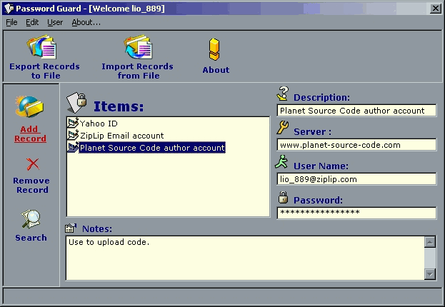



## Password Guard v1\.5

### Description

Password Guard is a complete application that lets you store User Names, Password, and Secret Notes easily and securely. It can be used by multiple users with no limitations on number of users or records. It utilizes special data encryption algorithms and string manipulation techniques which provide a high level of security. Not only you'll learn how to encrypt data, you also learn how to do advanced string manipulation techniques, use the registry, and generate random strings.

Version (1.5) adds a full-scale search capability, the Access Logging feature, and the ability to recover Master Password (if lost).
 
### More Info
 

             |
---                |---
**Submitted On**   |2001-02-10 16:40:26
**By**             |[Lio\_889](https://github.com/Planet-Source-Code/PSCIndex/blob/master/ByAuthor/lio-889.md)
**Level**          |Intermediate
**User Rating**    |4.6 (23 globes from 5 users)
**Compatibility**  |VB 5\.0, VB 6\.0
**Category**       |[Encryption](https://github.com/Planet-Source-Code/PSCIndex/blob/master/ByCategory/encryption__1-48.md)
**World**          |[Visual Basic](https://github.com/Planet-Source-Code/PSCIndex/blob/master/ByWorld/visual-basic.md)
**Archive File**   |[CODE\_UPLOAD147672102001\.zip](https://github.com/Planet-Source-Code/lio-889-password-guard-v1-5__1-15179/archive/master.zip)

